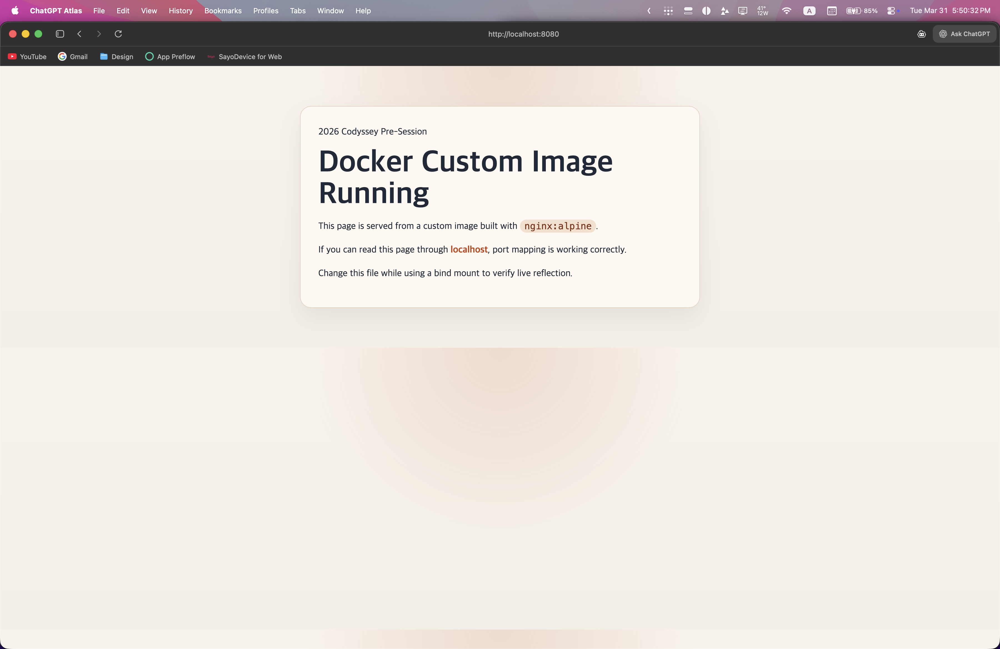
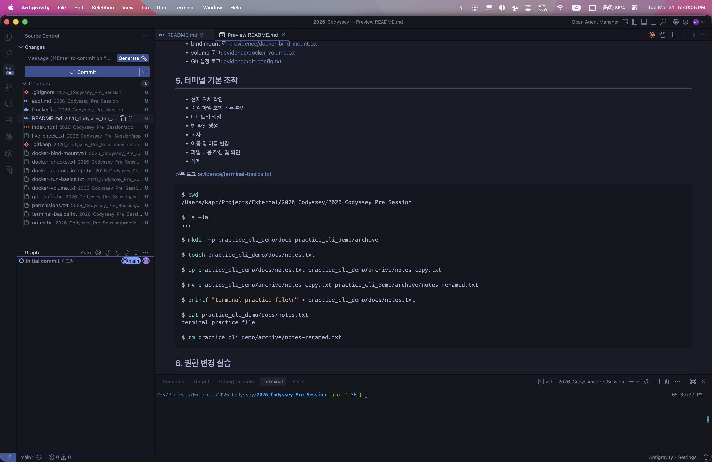

# 2026 Codyssey Pre-Session

GitHub Repository: <https://github.com/kyowon1108/2026_Codyssey_Pre_Session>

## 1. 실행 환경

| 항목 | 값 |
| --- | --- |
| OS | macOS 26.2 |
| Shell | `zsh` |
| Docker | `29.1.3` |
| Git | `2.50.1 (Apple Git-155)` |

```bash
$ sw_vers
ProductName:		macOS
ProductVersion:		26.2
BuildVersion:		25C56

$ docker --version
Docker version 29.1.3, build f52814d

$ git --version
git version 2.50.1 (Apple Git-155)
```

## 2. 수행 체크리스트

- [x] 터미널 기본 조작 및 폴더 구성
- [x] 파일 1개, 디렉토리 1개 권한 변경 실습
- [x] Docker 설치 및 데몬 동작 확인
- [x] `hello-world` 실행
- [x] `ubuntu` 컨테이너 실행 후 내부 명령 수행
- [x] Dockerfile 기반 커스텀 이미지 빌드
- [x] 포트 매핑 검증
- [x] bind mount 반영 검증
- [x] Docker volume 영속성 검증
- [x] Git 사용자 정보 및 기본 브랜치 설정 확인

## 3. 저장소 구조

```text
.
├── Dockerfile
├── README.md
├── app/
│   ├── index.html
│   └── live-check.txt
├── evidence/
│   ├── browser-8080.png
│   ├── docker-bind-mount.txt
│   ├── docker-checks.txt
│   ├── docker-custom-image.txt
│   ├── docker-run-basics.txt
│   ├── docker-volume.txt
│   ├── git-config.txt
│   ├── permissions.txt
│   ├── terminal-basics.txt
│   └── vscode-source-control.png
└── practice_cli_demo/
```

## 4. 로그 위치

- 터미널 조작 로그: [evidence/terminal-basics.txt](evidence/terminal-basics.txt)
- 권한 변경 로그: [evidence/permissions.txt](evidence/permissions.txt)
- Docker 기본 점검 로그: [evidence/docker-checks.txt](evidence/docker-checks.txt)
- 컨테이너 실행 로그: [evidence/docker-run-basics.txt](evidence/docker-run-basics.txt)
- 커스텀 이미지 로그: [evidence/docker-custom-image.txt](evidence/docker-custom-image.txt)
- 브라우저 접속 화면: [evidence/browser-8080.png](evidence/browser-8080.png)
- bind mount 로그: [evidence/docker-bind-mount.txt](evidence/docker-bind-mount.txt)
- volume 로그: [evidence/docker-volume.txt](evidence/docker-volume.txt)
- Git 설정 로그: [evidence/git-config.txt](evidence/git-config.txt)
- VSCode Source Control 화면: [evidence/vscode-source-control.png](evidence/vscode-source-control.png)

## 5. 터미널 기본 조작

- 현재 위치 확인
- 숨김 파일 포함 목록 확인
- 디렉토리 생성
- 빈 파일 생성
- 복사
- 이동 및 이름 변경
- 파일 내용 작성 및 확인
- 삭제

원본 로그 :[evidence/terminal-basics.txt](evidence/terminal-basics.txt)

```bash
$ pwd
/Users/kapr/Projects/External/2026_Codyssey/2026_Codyssey_Pre_Session

$ ls -la
...

$ mkdir -p practice_cli_demo/docs practice_cli_demo/archive

$ touch practice_cli_demo/docs/notes.txt

$ cp practice_cli_demo/docs/notes.txt practice_cli_demo/archive/notes-copy.txt

$ mv practice_cli_demo/archive/notes-copy.txt practice_cli_demo/archive/notes-renamed.txt

$ printf "terminal practice file\n" > practice_cli_demo/docs/notes.txt

$ cat practice_cli_demo/docs/notes.txt
terminal practice file

$ rm practice_cli_demo/archive/notes-renamed.txt
```

## 6. 권한 변경 실습

- 디렉토리: `practice_cli_demo`
- 파일: `practice_cli_demo/docs/notes.txt`

### 권한
- `r`: 읽기 권한
- `w`: 쓰기 권한
- `x`: 실행 권한 또는 디렉토리 접근 권한
- `755`: 소유자 `rwx`, 그룹 `r-x`, 기타 사용자 `r-x`
- `644`: 소유자 `rw-`, 그룹 `r--`, 기타 사용자 `r--`

원본 로그 : [evidence/permissions.txt](evidence/permissions.txt)

```bash
$ ls -ld practice_cli_demo
drwxr-xr-x@ 4 kapr  staff  128 Mar 31 17:15 practice_cli_demo

$ ls -l practice_cli_demo/docs/notes.txt
-rw-r--r--@ 1 kapr  staff  23 Mar 31 17:15 practice_cli_demo/docs/notes.txt

$ chmod 700 practice_cli_demo
$ chmod 600 practice_cli_demo/docs/notes.txt

$ ls -ld practice_cli_demo
drwx------@ 4 kapr  staff  128 Mar 31 17:15 practice_cli_demo

$ ls -l practice_cli_demo/docs/notes.txt
-rw-------@ 1 kapr  staff  23 Mar 31 17:15 practice_cli_demo/docs/notes.txt
```

## 7. Docker 설치 및 기본 점검

- `docker --version`
- `docker info`
- `docker images`

원본 로그 : [evidence/docker-checks.txt](evidence/docker-checks.txt)

```bash
$ docker --version
Docker version 29.1.3, build f52814d

$ docker info
...
Server Version: 29.1.3
Operating System: Docker Desktop
OSType: linux
Architecture: aarch64
...
```

## 8. 컨테이너 실행 실습

- `hello-world` 이미지 자동 다운로드 및 실행 성공
- `ubuntu` 컨테이너 실행 성공
- `docker exec`로 컨테이너 내부 명령 수행 성공
- `docker ps -a`로 종료 상태 확인 성공

원본 로그 : [evidence/docker-run-basics.txt](evidence/docker-run-basics.txt)

```bash
$ docker run --name codyssey-hello hello-world
Hello from Docker!
...

$ docker run -d --name codyssey-ubuntu ubuntu sleep infinity
5abc84f697eb9ddf5ce7616c230a678dd99104cbfd15262cd0fa427f5bdcad63

$ docker exec codyssey-ubuntu bash -lc 'ls / | head -n 10 && echo inside-container'
bin
boot
dev
etc
home
lib
media
mnt
opt
proc
inside-container
```

### `attach`와 `exec` 차이
- `attach` : 기존 메인 프로세스에 직접 붙는 방식
- `exec` : 실행 중인 컨테이너 안에서 별도 명령을 수행하는 방식
- 점검과 실습에는 `exec`가 더 안전하고 편함

## 9. Dockerfile 기반 커스텀 이미지

### 선택한 베이스 이미지

- `nginx:alpine`

### 커스텀 포인트

- `LABEL`: 이미지 목적 식별용 메타데이터 추가
- `ENV APP_ENV=dev`: 환경 변수 예시를 추가
- `COPY app/ /usr/share/nginx/html/`: 정적 웹 페이지를 이미지에 포함

```Dockerfile
FROM nginx:alpine

LABEL org.opencontainers.image.title="codyssey-pre-session-web"
LABEL org.opencontainers.image.description="Simple static site for Docker workstation assignment"

ENV APP_ENV=dev

COPY app/ /usr/share/nginx/html/
```

원본 로그 : [evidence/docker-custom-image.txt](evidence/docker-custom-image.txt)

```bash
$ docker build -t codyssey-web:1.0 .

$ docker run -d --name codyssey-web-8080 -p 8080:80 codyssey-web:1.0
691153ad637febdeb73d9def01329863f95ceaf25d10002259ab56da711d160f

$ curl -fsS http://localhost:8080 | head -n 8
<!DOCTYPE html>
<html lang="ko">
  <head>
    <meta charset="UTF-8" />
    <meta name="viewport" content="width=device-width, initial-scale=1.0" />
    <title>Codyssey Docker Practice</title>
```

이미지 목록

```bash
$ docker images --format 'table {{.Repository}}\t{{.Tag}}\t{{.ID}}\t{{.Size}}' | rg 'REPOSITORY|codyssey-web|nginx|ubuntu|hello-world'
REPOSITORY     TAG         IMAGE ID       SIZE
codyssey-web   1.0         ec0081ef0fe7   91.8MB
nginx          alpine      e7257f1ef28b   92.7MB
hello-world    latest      452a468a4bf9   22.6kB
ubuntu         latest      186072bba1b2   141MB
```

## 10. 포트 매핑 검증

컨테이너 내부 포트 `80`을 호스트 포트 `8080`에 연결해 로컬에서 접근 가능한지 확인

```bash
$ docker run -d --name codyssey-web-8080 -p 8080:80 codyssey-web:1.0
$ curl -fsS http://localhost:8080
```



### 포트 매핑이 필요한 이유
- 컨테이너 네트워크는 기본적으로 격리되어 있음
- 호스트에서 접근하려면 `-p 호스트포트:컨테이너포트` 연결 필요

## 11. Bind Mount 반영 검증

원본 로그 : [evidence/docker-bind-mount.txt](evidence/docker-bind-mount.txt)

```bash
$ docker run -d --name codyssey-bind-8081 -p 8081:80 -v "$PWD/app:/usr/share/nginx/html" nginx:alpine
f7957214fd400bdc7524e9ede9f7ab20371e10751d461d721ac0df4bb4ed34e2

$ curl -fsS http://localhost:8081/live-check.txt
before bind mount update

$ printf 'after bind mount update\n' > app/live-check.txt

$ curl -fsS http://localhost:8081/live-check.txt
after bind mount update
```

### bind mount가 필요한 이유

- 이미지 재빌드 없이 호스트 변경사항을 바로 반영 가능
- 개발 중 빠른 확인과 디버깅에 유리함

## 12. Docker Volume 영속성 검증

원본 로그 : [evidence/docker-volume.txt](evidence/docker-volume.txt)

```bash
$ docker volume create codyssey-data
codyssey-data

$ docker run -d --name codyssey-vol-1 -v codyssey-data:/data ubuntu sleep infinity
...

$ docker exec codyssey-vol-1 bash -lc 'echo persistent-data > /data/persist.txt && cat /data/persist.txt'
persistent-data

$ docker rm -f codyssey-vol-1
codyssey-vol-1

$ docker run -d --name codyssey-vol-2 -v codyssey-data:/data ubuntu sleep infinity
...

$ docker exec codyssey-vol-2 bash -lc 'cat /data/persist.txt'
persistent-data
```

### volume이 필요한 이유
- 컨테이너는 삭제 시 내부 데이터가 사라질 수 있음
- volume은 컨테이너 생명주기와 분리된 저장공간을 제공함
- 따라서 영속 데이터 저장에 적합함

## 13. Git 설정 및 GitHub 연동

Git 설정 로그 : [evidence/git-config.txt](evidence/git-config.txt)

```bash
$ git config --list
credential.helper=osxkeychain
init.defaultbranch=main
user.name=kyowon1108
user.email=[masked]
...

$ git remote -v
origin  https://github.com/kyowon1108/2026_Codyssey_Pre_Session (fetch)
origin  https://github.com/kyowon1108/2026_Codyssey_Pre_Session (push)
```




## Git과 GitHub의 역할 차이

- Git : 로컬 버전 관리 도구
- GitHub : 원격 저장소와 협업 기능을 제공하는 플랫폼

## 14. 핵심 개념 정리

### 절대 경로와 상대 경로

- 절대 경로 : `/Users/kapr/Projects/.../app/index.html`처럼 루트부터 시작하는 전체 경로
- 상대 경로 : 현재 위치를 기준으로 `app/index.html`처럼 표현하는 방식

### 포트 매핑

- 컨테이너 내부 포트를 호스트 외부에 연결하는 방식
- 예시로 `-p 8080:80`은 호스트 `8080` 요청을 컨테이너 `80`으로 전달

### 커스텀 이미지

- 기존 베이스 이미지를 바탕으로 필요한 파일과 설정을 추가한 이미지
- `nginx:alpine` 위에 정적 페이지를 복사해 새 이미지 제작

## 15. 트러블슈팅

### 사례 1. 컨테이너 실행 직후 `curl` 응답이 비어 있음

- 문제: `docker run -d` 직후 바로 `curl http://localhost:8080`을 실행했더니 기대한 HTML이 즉시 보이지 않음
- 원인 가설: nginx 초기화가 끝나기 전에 요청이 먼저 들어간 것으로 추정
- 확인: `docker logs codyssey-web-8080`에서 엔트리포인트 초기화 로그가 먼저 출력되는 것을 확인
- 해결: `curl` 앞에 짧은 재시도 루프를 넣어 준비 완료 후 응답을 수집함

### 사례 2. bind mount 검증을 한 번에 자동화할 때 중간 실패

- 문제: build, run, bind mount, volume 검증을 한 번에 긴 셸 스크립트로 묶었더니 중간에 비정상 종료 발생
- 원인 가설: bind mount 컨테이너가 완전히 뜨기 전에 `curl`을 호출한 데다, 긴 명령 문자열도 관리하기 어려움
- 확인: 실패 시점이 bind mount 구간 직후였고, 컨테이너 자체는 올라와 있었음
- 해결: bind mount와 volume 검증을 별도 단계로 나누고 재시도 루프를 넣어 안정적으로 증거를 수집함

## 16. 재현 방법

```bash
git clone https://github.com/kyowon1108/2026_Codyssey_Pre_Session.git
cd 2026_Codyssey_Pre_Session

docker build -t codyssey-web:1.0 .
docker run -d --name codyssey-web-8080 -p 8080:80 codyssey-web:1.0
curl http://localhost:8080

docker run -d --name codyssey-bind-8081 -p 8081:80 -v "$PWD/app:/usr/share/nginx/html" nginx:alpine
curl http://localhost:8081/live-check.txt

docker volume create codyssey-data
docker run -d --name codyssey-vol-1 -v codyssey-data:/data ubuntu sleep infinity
docker exec codyssey-vol-1 bash -lc 'echo persistent-data > /data/persist.txt && cat /data/persist.txt'
docker rm -f codyssey-vol-1
docker run -d --name codyssey-vol-2 -v codyssey-data:/data ubuntu sleep infinity
docker exec codyssey-vol-2 bash -lc 'cat /data/persist.txt'
```
